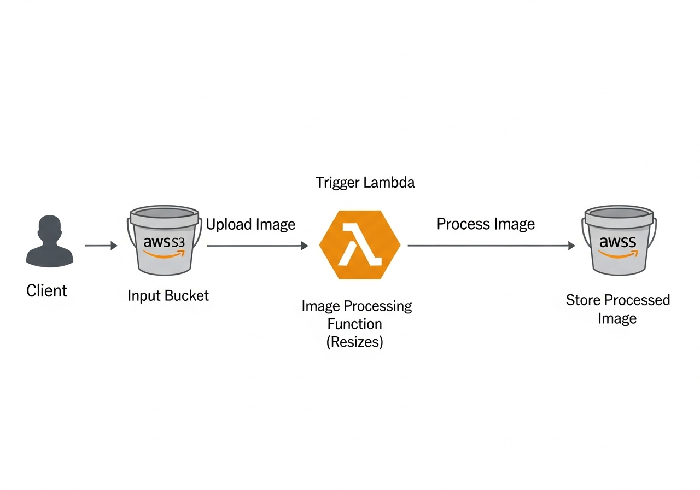
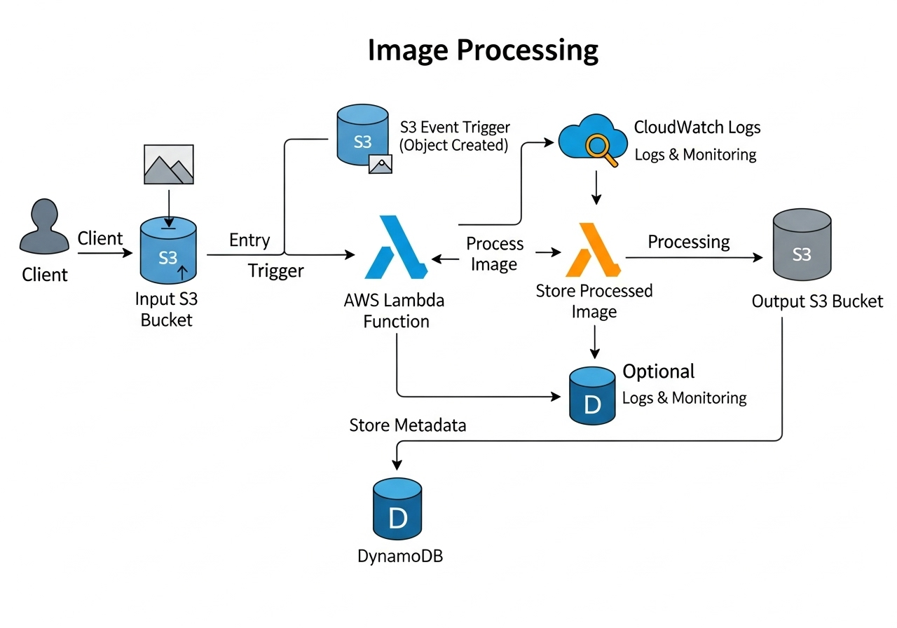

# Serverless Image Processing with S3 and Lambda

Transform, optimize, and deliver images in real time using AWS serverless technologies.

 


## Table of Contents

- [Solution Overview](#solution-overview)
- [Architecture](#architecture)
- [Features](#features)
- [Prerequisites](#prerequisites)
- [Quick Start](#quick-start)
- [Deployment Options](#deployment-options)
- [Configuration](#configuration)
- [Usage](#usage)
- [Monitoring](#monitoring)
- [Security](#security)
- [Cost Optimization](#cost-optimization)
- [Troubleshooting](#troubleshooting)
- [Contributing](#contributing)
- [License](#license)

## Solution Overview

This solution provides a serverless image processing pipeline using AWS services. When users upload images to an S3 bucket, the system automatically triggers a Lambda function that processes and resizes the images before storing them in another S3 bucket.

### Key Benefits

- **Serverless Architecture**: No infrastructure to manage, automatic scaling
- **Cost Effective**: Pay only for what you use
- **High Availability**: Built on AWS's reliable infrastructure
- **Secure**: Comprehensive security controls and encryption
- **Scalable**: Handles thousands of concurrent image processing requests

## Architecture

The solution implements an event-driven serverless architecture:

1. **Input S3 Bucket**: Receives original images
2. **Lambda Function**: Processes images (resize, optimize)
3. **Output S3 Bucket**: Stores processed images
4. **DynamoDB** (Optional): Stores image metadata
5. **CloudWatch**: Monitoring and logging

### AWS Services Used

- **Amazon S3**: Object storage for input and output images
- **AWS Lambda**: Serverless compute for image processing
- **Amazon DynamoDB**: NoSQL database for metadata (optional)
- **Amazon CloudWatch**: Monitoring and logging
- **AWS IAM**: Identity and access management

## Features

- **Automatic Image Processing**: Triggered by S3 upload events
- **Multiple Format Support**: JPG, PNG, GIF, BMP, TIFF, WebP
- **Intelligent Resizing**: Maintains aspect ratio while resizing
- **Format Optimization**: Automatic format conversion and compression
- **Error Handling**: Comprehensive error handling and retry logic
- **Monitoring**: Built-in CloudWatch metrics and logging
- **Security**: Encryption at rest and in transit
- **Infrastructure as Code**: CloudFormation and Terraform templates

## Prerequisites

- AWS CLI configured with appropriate permissions
- Node.js 18.x or later (for CloudFormation deployment)
- Terraform 1.0+ (for Terraform deployment)
- Python 3.9+ (for local development)

## Quick Start

### Option 1: CloudFormation Deployment

```bash
# Clone the repository
git clone https://github.com/ahmed-el-mahdy/serverless-image-processing.git
cd serverless-image-processing

# Deploy using AWS SAM
cd infrastructure/cloudformation
sam build
sam deploy --guided
```

### Option 2: Terraform Deployment

```bash
# Clone the repository
git clone https://github.com/ahmed-el-mahdy/serverless-image-processing.git
cd serverless-image-processing

# Deploy using Terraform
cd infrastructure/terraform
terraform init
terraform plan
terraform apply
```

## Deployment Options

### CloudFormation/SAM
- Native AWS integration
- Simplified serverless resource management
- Built-in best practices

### Terraform
- Multi-cloud support
- Advanced state management
- Extensive provider ecosystem

See the [deployment guide](./docs/COMPREHENSIVE_DOCUMENTATION.md#deployment-guide) for detailed instructions.

## Configuration

### Environment Variables

The Lambda function supports the following environment variables:

| Variable | Description | Default |
|----------|-------------|---------|
| `OUTPUT_BUCKET` | S3 bucket for processed images | Required |
| `RESIZE_WIDTH` | Target width for resized images | 800 |
| `RESIZE_HEIGHT` | Target height for resized images | 600 |

### Processing Parameters

- **Image Formats**: Supports JPG, PNG, GIF, BMP, TIFF, WebP
- **Max File Size**: 50MB (Lambda limit)
- **Processing Timeout**: 30 seconds
- **Memory Allocation**: 512MB (configurable)

## Usage

### Upload Images

Upload images to the input S3 bucket using:

- AWS Console
- AWS CLI
- SDKs
- Direct API calls

```bash
# Example using AWS CLI
aws s3 cp image.jpg s3://your-input-bucket/
```

### Retrieve Processed Images

Processed images are automatically stored in the output bucket with a `processed-` prefix:

```bash
# Example using AWS CLI
aws s3 cp s3://your-output-bucket/processed-image.jpg ./
```

## Monitoring

The solution provides comprehensive monitoring through:

- **CloudWatch Metrics**: Function duration, error rates, concurrent executions
- **CloudWatch Logs**: Detailed execution logs and error messages
- **Custom Metrics**: Processing success rates, image size distributions

### Key Metrics to Monitor

- Lambda function duration and memory usage
- S3 request rates and error rates
- Processing success and failure rates
- Cost metrics and optimization opportunities

## Security

The solution implements multiple security layers:

- **IAM Roles**: Principle of least privilege
- **Encryption**: At rest (S3, DynamoDB) and in transit (HTTPS)
- **VPC Integration**: Optional private network deployment
- **Access Logging**: Comprehensive audit trails

See the [security documentation](./docs/COMPREHENSIVE_DOCUMENTATION.md#security-considerations) for detailed information.

## Cost Optimization

- **Pay-per-use**: No fixed infrastructure costs
- **Automatic scaling**: Resources scale with demand
- **Storage optimization**: Intelligent tiering for processed images
- **Memory tuning**: Optimize Lambda memory allocation

Typical costs for processing 1,000 images per day: $2-5/month

## Troubleshooting

### Common Issues

1. **Cold Start Performance**: Optimize memory allocation and initialization code
2. **Processing Timeouts**: Increase timeout or optimize processing logic
3. **Permission Errors**: Verify IAM roles and policies
4. **Format Errors**: Ensure uploaded files are valid images

See the [troubleshooting guide](./docs/COMPREHENSIVE_DOCUMENTATION.md#troubleshooting) for detailed solutions.

## Contributing

We welcome contributions! Please see our [Contributing Guide](./CONTRIBUTING.md) for details on:

- Code of conduct
- Development setup
- Submission process
- Testing requirements

## License

This project is licensed under the Apache License 2.0 - see the [LICENSE](./LICENSE) file for details.

## Support

- **Documentation**: [Comprehensive Documentation](./docs/COMPREHENSIVE_DOCUMENTATION.md)
- **Issues**: [GitHub Issues](https://github.com/ahmed-el-mahdy/serverless-image-processing/issues)
- **Discussions**: [GitHub Discussions](https://github.com/ahmed-el-mahdy/serverless-image-processing/discussions)

---

**Note**: This solution is designed for educational and demonstration purposes. For production use, please review and customize the security, monitoring, and operational aspects according to your specific requirements.

